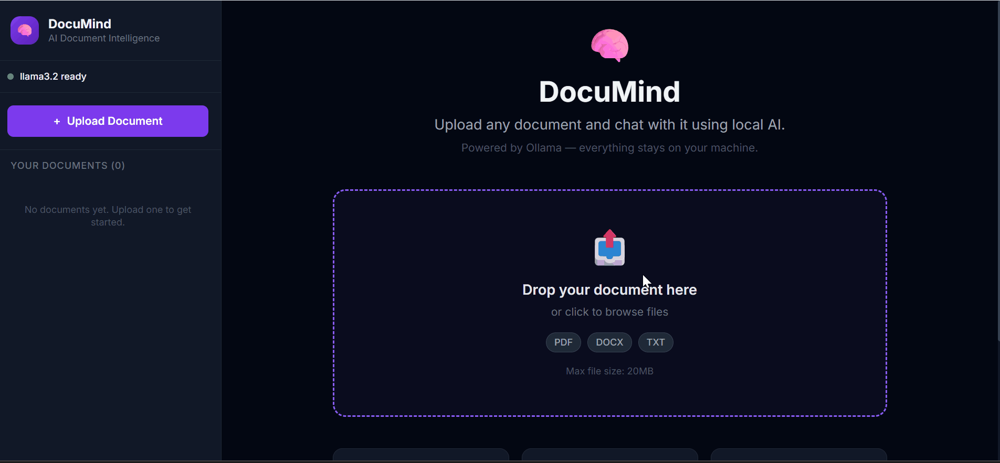
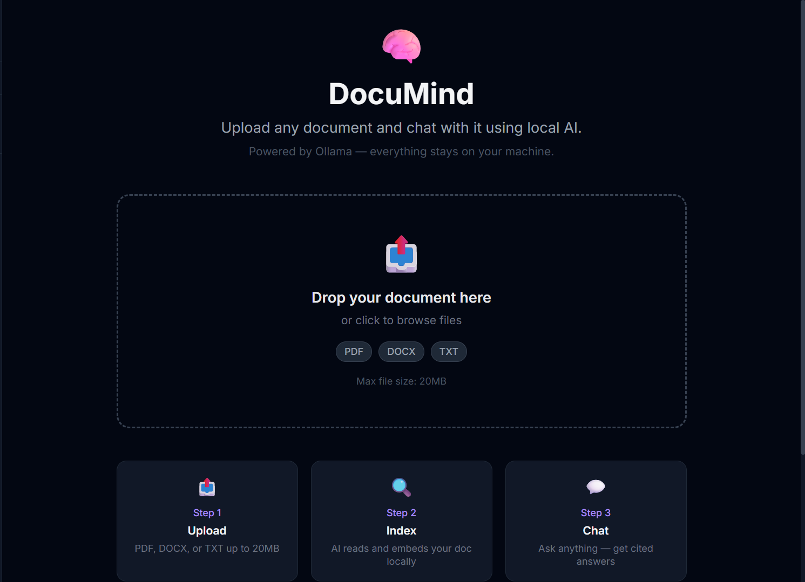
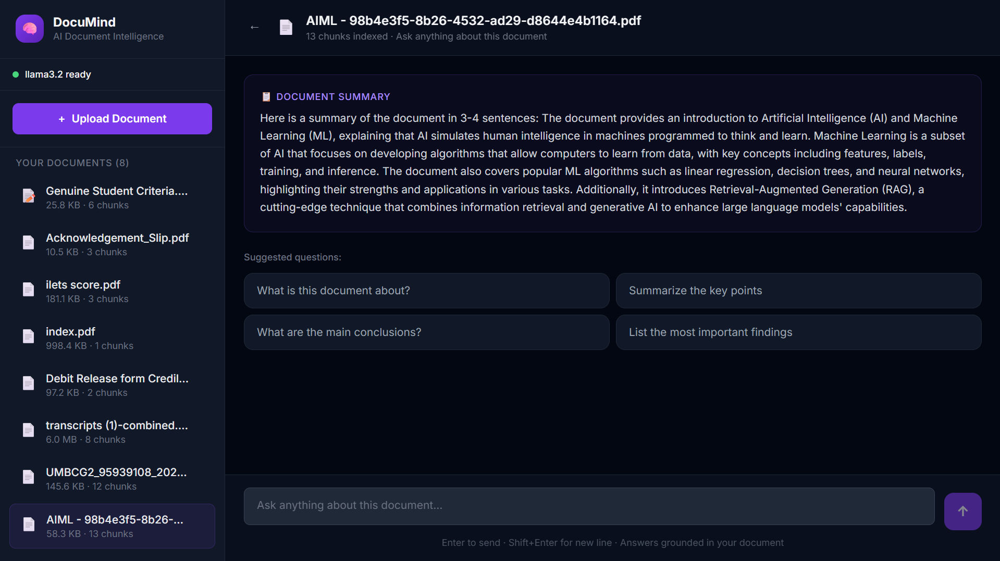

# 🧠 DocuMind — AI Document Intelligence Platform


> Upload any PDF, DOCX, or TXT and have an intelligent conversation 
> with it — powered entirely by local AI. No cloud. No API keys. 
> 100% private.

## 🔗 Live Demo
## ⚠️ Local Setup Required
This app runs on your local machine using Ollama.
There is no hosted demo since the LLM runs on-device.
See the [Setup Guide](#️⚙️ STEP 1 — Install & Setup Ollama (Windows)) below to run it yourself.


## 🎬 Demo




## Screenshots

### Upload & Index


### Chat with Citations



## ⚡ Tech Stack
| Layer | Technology |
|---|---|
| Frontend | React 18, TailwindCSS, Vite |
| Backend | FastAPI, Python |
| AI/LLM | Ollama (Llama 3.2) |
| Embeddings | all-MiniLM via Ollama |
| Vector DB | ChromaDB |
| RAG Framework | LangChain |

## Architecture

```
User uploads document
        ↓
FastAPI parses it (PDF/DOCX/TXT)
        ↓
Text split into chunks (LangChain RecursiveTextSplitter)
        ↓
Each chunk → nomic-embed-text (Ollama) → vector embedding
        ↓
Embeddings stored in ChromaDB (local vector database)
        ↓
User asks a question
        ↓
Question → embedding → similarity search in ChromaDB
        ↓
Top 5 matching chunks retrieved (RAG)
        ↓
Chunks + question → Llama3 (Ollama) → streamed answer
        ↓
Answer displayed with source citations
```

---

## ⚙️ STEP 1 — Install & Setup Ollama (Windows)

### 1.1 Download Ollama
1. Go to **https://ollama.com/download**
2. Click **"Download for Windows"**
3. Run the installer (`OllamaSetup.exe`)
4. Ollama installs as a background service — you'll see it in your system tray

### 1.2 Verify Ollama is running
Open Command Prompt and run:
```bash
ollama --version
```
You should see something like: `ollama version 0.3.x`

### 1.3 Pull the required models
This is the most important step. Run these two commands:

```bash
# Pull the main LLM (chat model) — ~4.7GB download
ollama pull llama3.2

# Pull the embedding model — ~274MB download
ollama pull all-minilm
```

Wait for both to finish downloading. This only needs to be done once.

### 1.4 Verify models are available
```bash
ollama list
```
You should see both `llama3` and `nomic-embed-text` in the list.

### 1.5 Test Ollama manually (optional)
```bash
ollama run llama3
# Type: Hello, who are you?
# Press Ctrl+D to exit
```

---

## 🐍 STEP 2 — Backend Setup

Open a new terminal in the `documind/backend/` folder:

```bash
# 1. Navigate to backend
cd documind/backend

# 2. Create virtual environment
python -m venv venv

# 3. Activate it
# Windows:
venv\Scripts\activate
# Mac/Linux:
source venv/bin/activate

# 4. Install dependencies
pip install -r requirements.txt

# Note: sentence-transformers and chromadb take a few minutes

# 5. Start the server
uvicorn main:app --reload --host 0.0.0.0 --port 8000
```

Backend is live at: **http://localhost:8000**
API docs at:        **http://localhost:8000/docs**

---

## ⚛️ STEP 3 — Frontend Setup

Open a SECOND terminal in `documind/frontend/`:

```bash
# 1. Navigate to frontend
cd documind/frontend

# 2. Install packages
npm install

# 3. Start dev server
npm run dev
```

Frontend is live at: **http://localhost:5173**

---

## 🚀 STEP 4 — Using DocuMind

1. Open **http://localhost:5173**
2. Check the sidebar — you should see **"llama3 ready"** with a green dot
3. Upload a PDF, DOCX, or TXT file using the dropzone
4. Wait 30–90 seconds for indexing (depends on file size)
5. Start chatting! Ask anything about the document.
6. See **source citations** below each answer — click to expand

---

## Project Structure

```
documind/
├── backend/
│   ├── main.py              ← FastAPI app entry point
│   ├── requirements.txt
│   ├── .env                 ← Config (model names, chunk size etc)
│   ├── core/
│   │   └── config.py        ← Pydantic settings
│   ├── models/
│   │   └── schemas.py       ← Request/response schemas
│   ├── routers/
│   │   ├── documents.py     ← Upload, list, delete endpoints
│   │   ├── chat.py          ← Streaming chat endpoint (SSE)
│   │   └── health.py        ← Ollama status check
│   └── services/
│       ├── parser.py        ← PDF/DOCX/TXT text extraction
│       ├── vector_store.py  ← ChromaDB indexing & search
│       ├── llm.py           ← Ollama LLM + RAG chain
│       └── doc_store.py     ← Document metadata (JSON)
└── frontend/
    └── src/
        ├── api/client.js         ← Axios + SSE streaming client
        ├── components/
        │   ├── Layout.jsx        ← Sidebar with document list
        │   ├── OllamaStatus.jsx  ← Live Ollama health indicator
        │   ├── UploadZone.jsx    ← Drag & drop uploader
        │   ├── MessageBubble.jsx ← Chat message with markdown
        │   └── SourcesPanel.jsx  ← Collapsible source citations
        └── pages/
            ├── Home.jsx          ← Upload page + doc list
            └── ChatPage.jsx      ← Full chat interface with SSE
```

---

## API Endpoints

| Method | Endpoint              | Description                    |
|--------|-----------------------|--------------------------------|
| GET    | /health/              | Ollama connection status       |
| GET    | /documents/           | List all uploaded documents    |
| POST   | /documents/upload     | Upload + parse + index document|
| GET    | /documents/{id}       | Get document metadata          |
| DELETE | /documents/{id}       | Delete document + embeddings   |
| POST   | /chat/stream          | Stream chat via SSE            |
| POST   | /chat/ask             | Non-streaming chat             |

---

## Troubleshooting

**Ollama offline (red dot in sidebar)**
→ Make sure Ollama is running. Open Task Manager and look for `ollama.exe`
→ Or restart it: search "Ollama" in Start Menu and launch it

**Model not loaded (yellow dot)**
→ Run: `ollama pull llama3` and `ollama pull nomic-embed-text`

**Upload fails / slow indexing**
→ Normal for large PDFs — embedding takes 30–90s
→ Check backend terminal for error details

**"No relevant content found"**
→ The question is too vague or unrelated to the document
→ Try a more specific question

---

## Key Technical Concepts (for interviews)

- **RAG (Retrieval Augmented Generation)**: Instead of asking the LLM to memorize the document, we retrieve relevant chunks at query time and give them as context. This prevents hallucination and allows citing sources.

- **Chunking strategy**: Documents are split into 800-token overlapping chunks (150 token overlap) using RecursiveCharacterTextSplitter — overlap preserves context across chunk boundaries.

- **Vector embeddings**: Each chunk is converted to a 768-dimension vector using `nomic-embed-text`. Similar meaning = similar vectors = close in vector space.

- **Cosine similarity search**: ChromaDB finds the top-5 chunks whose vectors are most similar (by cosine similarity) to the query vector.

- **Streaming SSE**: The LLM response streams token-by-token via Server-Sent Events, giving the ChatGPT-like typing experience without WebSockets.
